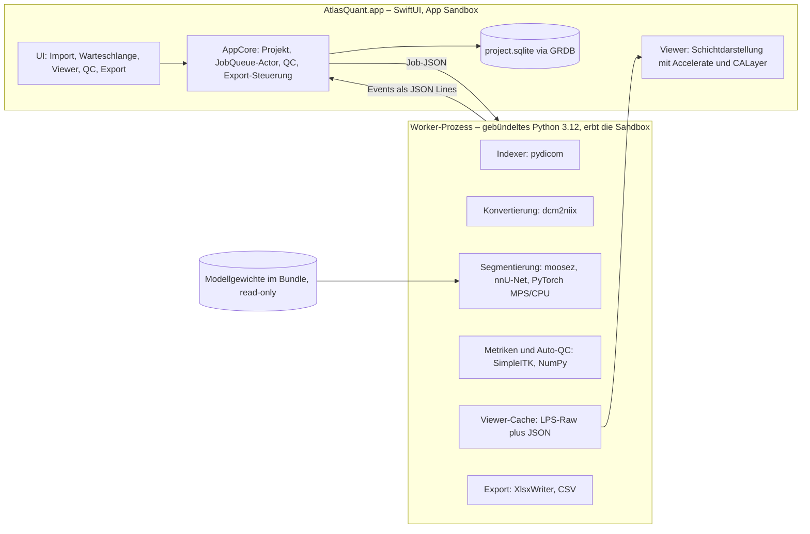
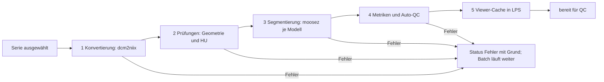

# Claude-Code-Prompt: Mac-App für MOOSE-Segmentierung (Forschung)

Oct 2, 2026 · @Johannes Ludwig

## So nutzt du dieses Dokument

Dieses Dokument ist der vollständige Auftrag an Claude Code: Exportiere es als Markdown und lege es als `docs/PLAN.md` in ein neues Repository.

- **Startbefehl in Claude Code:** „Lies `docs/PLAN.md` vollständig. Lege `CLAUDE.md` gemäß Abschnitt 20 an, beginne mit Meilenstein M0 (Spikes) und berichte die Ergebnisse, bevor du weitermachst.“
- **Vorher klären:** die offenen Entscheidungen am Ende von Abschnitt 19 (Name, Verteilungsweg, Developer-Account, Modellumfang).
- **Pflegen:** Der Plan bleibt die Quelle der Wahrheit. Abweichungen hält Claude Code als ADR fest und aktualisiert den Plan.

## 1. Rolle, Ziel und Produktvision

Du bist Senior-macOS-Entwickler mit Erfahrung in medizinischer Bildverarbeitung. Du baust **AtlasQuant** (Arbeitstitel, ohne „MOOSE“ im Namen): eine native Mac-App mit englischer Oberfläche, die MOOSE 3.2 vollständig offline ausführt, Segmentierungen radiologisch darstellt und Ergebnisse als Excel exportiert.

**Zielgruppe:** Forschende in Radiologie und Nuklearmedizin ohne Python-Kenntnisse, auf Macs mit Apple Silicon.

**Kern-Workflow**

1. Projekt anlegen oder öffnen.
2. Einen oder mehrere Quellordner hinzufügen; die App indexiert alle DICOM-Serien.
3. Serien auswählen: automatischer Vorschlag pro Untersuchung, manuell änderbar.
4. MOOSE-Modelle wählen (einzeln oder als Preset) und den Batch für alle ausgewählten Patienten starten.
5. Ergebnisse im Viewer prüfen, Segmentierungen ein- und ausblenden, QC-Status vergeben.
6. Ergebnisse als Excel exportieren, wahlweise mit einer Zeile pro Patient für die gemeinsame Auswertung vieler Patienten; auf Wunsch zusätzlich ein PDF-Fallbericht je Fall mit Kennzahlen und Segmentierungsbildern, immer auf Englisch (ADR 0017).

**Hauptfenster:** Seitenleiste mit *Sources*, *Patients & Series*, *Queue*, *Results & QC* und *Export*. Der Viewer öffnet sich als Detailansicht oder als eigenes Fenster.

**Nicht-Ziele in v1:** keine Diagnose oder klinische Nutzung, keine manuelle Segmentierungsbearbeitung, keine PACS-Netzwerkanbindung, keine Cloud, kein Training eigener Modelle.

## 2. Nicht verhandelbare Rahmenbedingungen

Diese Punkte gelten für jede Zeile Code; ein Verstoß ist ein Bug.

1. **Alles im Bundle.** Python-Runtime, alle Pakete, alle MOOSE-Modellgewichte und dcm2niix werden mit der App ausgeliefert. Nach der Installation gibt es keinen Download, kein pip und keinen Update-Check.
2. **Offline by design.** Die App erhält kein Netzwerk-Entitlement (`com.apple.security.network.client`). Sie kann dadurch technisch keine Daten senden – ein starkes Argument gegenüber Datenschutz und Ethikkommission.
3. **Immer in der Sandbox.** Auch der DMG-Build läuft in der App Sandbox, damit der Weg in den Mac App Store offen bleibt.
4. **Apple Silicon und macOS 14+.** Aktuelle PyTorch-Versionen werden für Intel-Macs nicht mehr gebaut, MOOSE nutzt die Apple-GPU über MPS, und SwiftUI-Observation setzt macOS 14 voraus. MOOSE empfiehlt mindestens 16 GB RAM ([MOOSE README](https://github.com/ENHANCE-PET/MOOSE)).
5. **Forschungszweck.** UI und jeder Export tragen den Hinweis „For research use only. Not for clinical use.“ Keine diagnostischen Aussagen und kein Lizenz- oder Zustimmungsbildschirm beim Start (Store-Regel 2.4.5(vi)).
6. **Datenschutz.** Verarbeitung nur lokal, Export standardmäßig pseudonymisiert, keine Patientennamen in Datenbank, Logs oder Fehlermeldungen.
7. **Reproduzierbarkeit.** Alle Versionen sind gepinnt. Jede exportierte Zahl ist auf Analyse-Lauf, Softwareversionen, Modell-Prüfsumme und Rechengerät zurückführbar.
8. **Lizenzen.** MOOSE-Code steht unter Apache-2.0, die Modelle unter CC BY 4.0. Attribution in App und Export, kein „MOOSE“ im App-Namen (Abschnitt 14).
9. **Store-Regeln von Anfang an.** Keine Prozesse nach dem Beenden der App (2.4.5(iii)), Updates nur über den Store (2.4.5(vii)), alle Sprachen im Bundle (2.4.5(ix)), kein Nachladen von Code (2.5.2). Quelle: [App Review Guidelines](https://developer.apple.com/app-store/review/guidelines/).
10. **Englische Oberfläche.** Alle Texte der App sind US-Englisch: Menüs, Dialoge, Meldungen, Exportinhalte und Handbuch. Zahlen und Datumsangaben in der Oberfläche folgen der Systemregion. Exporte sind regionsunabhängig (ISO-8601-Daten, Punkt als Dezimaltrenner), außer in der ausdrücklich gewählten CSV-Variante mit Dezimalkomma.

## 3. Architektur und Technologieentscheidungen

Die App besteht aus einer nativen SwiftUI-Oberfläche und einem gebündelten Python-Backend, das pro Job als eigener Prozess in der Sandbox startet.



| Bereich | Entscheidung | Begründung | Verworfen |
| --- | --- | --- | --- |
| Oberfläche | SwiftUI, AppKit wo nötig (NSOpenPanel, CALayer) | nativ, Sandbox-freundlich, kein Web-Stack | Electron, Qt |
| Inferenz | `moosez` als Python-Bibliothek, exakt gepinnt | identisch zur publizierten Methode | eigene nnU-Net-Pipeline; Core ML erst in Phase 3 prüfen |
| Python | eingebettete, relokierbare CPython 3.12 (python-build-standalone oder BeeWare-Support-Paket, Entscheidung in Spike S3) | kein System-Python nötig; `multiprocessing` und Dask laufen unverändert | PyInstaller-Freeze, conda |
| Prozessmodell | frischer Worker-Prozess pro Job | Absturzisolation, Speicher wird nach jedem Job frei, Abbruch per Signal | Interpreter im App-Prozess |
| IPC | JSON Lines über stdout des Workers, Logs in eine Datei | einfach, testbar, sprachneutral | XPC (später möglich) |
| Persistenz | SQLite mit GRDB.swift (MIT) | offenes Schema, Migrationen, extern lesbar | SwiftData; NSDocument (Safe-Save würde GB-große Ordner kopieren) |
| Viewer | eigene Schichtdarstellung mit Accelerate/vImage und CALayer | volle Kontrolle über die Orientierung, pixelgenau testbar, kein WebKit | WebView mit NiiVue, VTK |
| Viewer-Daten | Worker orientiert Volumina kanonisch nach LPS um | keine Orientierungs-Mehrdeutigkeit im Swift-Code | NIfTI-Parsing in Swift |
| Excel | XlsxWriter (BSD-2) im Worker | ausgereift, schnell bei großen Dateien | Swift-Wrapper um libxlsxwriter |
| Fallbericht (PDF) | Worker schreibt je Fall eine Inhaltsdatei mit Lader und QC-Logik des Exports; die App zeichnet das PDF mit Core Graphics und Core Text | dieselben Zahlen wie im Export, Bilder aus den Bausteinen des Viewers, keine neue Abhängigkeit; scheitert der Spike, zeichnet matplotlib im Worker (ADR 0017) | WeasyPrint (Pango, Cairo), WebKit/HTML, SwiftUI-`ImageRenderer`, ReportLab, fpdf2 |
| Xcode-Projekt | XcodeGen (`project.yml`) | diffbar, agentenfreundlich | handgepflegte `.pbxproj` |
| Python-Pakete | `uv` mit Lockfile inklusive Hashes | reproduzierbare Builds | pip ohne Lockfile |

Jede Zeile der Tabelle wird als ADR in `docs/adr/` festgehalten, bevor der zugehörige Code entsteht.

## 4. Bundling: alles in der App

Das App-Bundle enthält Python-Runtime, alle Pakete, alle MOOSE-Modelle und dcm2niix; nach der Installation ist nichts nachzuladen. macOS-Apps dürfen im App Store unkomprimiert bis 200 GB groß sein ([App Store Connect](https://developer.apple.com/help/app-store-connect/reference/app-uploads/maximum-build-file-sizes)), die Größe ist also kein Ausschlussgrund.

**Bundle-Layout (Zielbild; Platzierung in Spike S3 bestätigen)**

```text
AtlasQuant.app/Contents/
  MacOS/AtlasQuant                Swift-App
  Frameworks/                     Swift-Abhängigkeiten
  Resources/python/               CPython 3.12 und site-packages, vorkompilierte .pyc
  Resources/backend/              eigenes Paket aq_backend
  Resources/models/               alle MOOSE-Modelle in nnU-Net-Struktur, read-only
  Resources/models/manifest.json  Name, Version, Quelle, SHA-256, Labels je Modell
  Resources/bin/dcm2niix          signiert als Sandbox-Helper
  Resources/licenses/             THIRD_PARTY_NOTICES.md und Lizenztexte
```

**Build-Schritte (Make-Targets, reproduzierbar)**

1. `make runtime`: relokierbare CPython 3.12 laden (Version und SHA-256 gepinnt) und Unnötiges entfernen (tkinter, idlelib, test, ensurepip).
2. App-Store-Patch: den String „itms-services“ aus `urllib/parse.py` entfernen. Apple lehnt Mac-Apps mit diesem String automatisch ab ([LWN](https://lwn.net/Articles/979671)); CPython bietet dafür die Build-Option `--with-app-store-compliance`. `make verify` prüft, dass der String nirgends im Bundle vorkommt.
3. Abhängigkeiten mit `uv` aus `requirements.lock` (mit Hashes) installieren: `moosez` exakt gepinnt (zuletzt 3.2.2, beim Start prüfen), PyTorch, nnunetv2, SimpleITK, XlsxWriter.
4. `make models`: `scripts/fetch_models.py` liest die Modellliste aus der gepinnten `moosez`-Version, lädt alle Modelle **zur Build-Zeit**, prüft SHA-256 gegen `models/manifest.lock.json` und legt eine Spiegelkopie im institutionellen Speicher ab (CC BY 4.0 erlaubt das).
5. `scripts/slim_checkpoints.py`: Optimizer-Zustände aus den nnU-Net-Checkpoints entfernen, Netzgewichte unverändert lassen. Benötigte Schlüssel im Spike bestimmen; Test: bitidentische Labelmaps vor und nach der Bereinigung. Die Änderung in der Attribution vermerken.
6. Python vorkompilieren (`compileall` mit `unchecked-hash`), Tests, Header und statische Bibliotheken entfernen, Größenbericht erzeugen.
7. Von innen nach außen signieren (Abschnitt 15).

**Laufzeit-Konfiguration des Workers**

- Start im isolierten Modus (`-I`) mit `PYTHONNOUSERSITE=1` und `PYTHONDONTWRITEBYTECODE=1`, denn das signierte Bundle ist schreibgeschützt.
- `PYTORCH_ENABLE_MPS_FALLBACK=1`; `MPLCONFIGDIR`, `TMPDIR` und Torch-Cache zeigen in den App-Container.
- Kein PyInstaller: Das echte eingebettete Python sorgt dafür, dass `multiprocessing` (spawn) und Dask unverändert funktionieren.

**MOOSE-Adapter (`aq_backend/moose_adapter.py`)**

- Spike S1 klärt: Wo sucht `moosez` die Modelle, wann lädt es nach, welche Netzwerkzugriffe gibt es, wie heißen die Ausgabedateien, und liegen sie im Raum des Eingangsbildes?
- Reihenfolge der Mittel: öffentliche API und Umgebungsvariablen, dann Laufzeit-Patch im Adapter, eine Änderung der Quelle nur im Notfall und dann gekennzeichnet (Apache-2.0).
- Versucht `moosez` trotzdem einen Download, bricht der Adapter mit „Model not found in app bundle“ ab, statt still zu scheitern.
- Zwei Fehler von `moosez` 3.2.2, die still falsche Zahlen liefern, korrigiert der Adapter: das seitenverkehrte Lungenmodell und die Wasserschichten an den Blockgrenzen des Resamplings (ADR 0018). Der Methodentext des Exports nennt beide.
- Die Bibliotheks-API `moose(input, model_names, output_dir, accelerator)` akzeptiert NIfTI-Pfade und SimpleITK-Bilder und unterstützt `"mps"` ([MOOSE README](https://github.com/ENHANCE-PET/MOOSE)).

**Option für später:** Apple-gehostete Background Assets (ab macOS 26) könnten die Modelle als Asset-Pack ausliefern und App-Updates verkleinern ([App Store Connect](https://developer.apple.com/help/app-store-connect/manage-asset-packs/overview-of-apple-hosted-asset-packs)). Nur einführen, wenn der Download für Nutzer ein einziger Schritt bleibt; in M7 prüfen.

## 5. Worker-Prozess und IPC-Protokoll

Für jeden Job startet die App einen frischen Python-Worker. Er meldet sich über JSON Lines auf stdout; alles andere landet in einer Logdatei.

**Lebenszyklus**

1. Die App schreibt `job.json` in den Projektordner und aktiviert die Security-Scoped Bookmarks der beteiligten Ordner (`startAccessingSecurityScopedResource`).
2. Sie startet `python -I -m aq_backend.worker run --job <pfad>`. Der Kindprozess erbt die Sandbox einschließlich der zu diesem Zeitpunkt aktiven Ordnerfreigaben – **in Spike S2 verifizieren**. Fallback: Serien vor der Verarbeitung in den Projektordner konvertieren.
3. Der Worker dupliziert stdout als Protokollkanal und leitet die Deskriptoren 1 und 2 per `os.dup2` in die Logdatei um. So stören MOOSE-Banner, Rich-Ausgaben und dcm2niix-Meldungen das Protokoll nicht.
4. Am Ende stehen ein `done`-Event und ein Exit-Code; Ergebnisse liegen als Dateien im Projektordner.

**Event-Typen**

| Typ | Pflichtfelder | Zweck |
| --- | --- | --- |
| `hello` | `protocol_version`, `versions` | Handshake, Versionen für die Provenienz |
| `progress` | `job_id`, `stage`, `fraction`, `message` | Fortschritt; `fraction` nur wo messbar, sonst `null` und Stufenfortschritt |
| `heartbeat` | `job_id`, `ts` | Lebenszeichen alle 10 s |
| `log` | `level`, `message` | englische Meldungen für die UI, ohne Patientendaten |
| `artifact` | `kind`, `path`, `sha256` | erzeugte Datei: NIfTI, Labelmap, Cache, Export |
| `result` | `job_id`, `payload` | strukturierte Ergebnisse, z. B. Metriken |
| `error` | `code`, `message`, `recoverable` | maschinenlesbarer Fehler |
| `done` | `job_id`, `status` | `ok`, `failed` oder `cancelled` |

```json
{"type":"progress","job_id":"j_0042","stage":"segment","model":"clin_ct_organs","fraction":null,"message":"Model 2 of 5"}
```

**Job-Arten:** `index`, `convert`, `segment`, `metrics`, `viewer_cache`, `export`, `selftest`.

**Abbruch und Robustheit**

- Abbruch: SIGTERM, der Worker räumt temporäre Dateien auf und endet mit Exit 130; nach 10 s folgt SIGKILL.
- Watchdog: Bleibt der Heartbeat 5 min aus, gilt der Job als hängend und wird beendet (Standardwerte, einstellbar).
- Beim Beenden der App werden alle Worker beendet (Store-Regel 2.4.5(iii)).
- Standard: ein Segmentierungs-Worker zur Zeit wegen des GPU-Speichers; Indexierung und Export dürfen parallel laufen.

**Verträge:** JSON-Schemas mit Beispiel-Fixtures liegen in `/Protocol`. Beide Testsuiten (Swift Codable, Python-Dataclasses) parsen alle Fixtures; jede Protokolländerung erhöht `protocol_version`.

## 6. Datenmodell, Projektordner und Persistenz

Ein Projekt ist ein vom Nutzer gewählter Ordner mit einer SQLite-Datenbank; die App merkt sich nur ein Security-Scoped Bookmark darauf.

```text
MeineStudie.aqproj/
  project.sqlite     Index, Auswahl, Läufe, Ergebnisse, QC, Audit-Log
  work/<serie>/      ct.nii.gz, labels/<modell>.nii.gz, metrics.json
  viewer-cache/      kanonische LPS-Volumina, LRU mit einstellbarem Größenlimit
  exports/           Excel/CSV, Masken, Reproduzierbarkeits-Pakete
  logs/              Worker-Logs pro Job, ohne Patientendaten
```

**Tabellen (GRDB-Migrationen; Schema dokumentiert in `docs/schema.md`)**

| Tabelle | Inhalt | Wichtige Felder |
| --- | --- | --- |
| `sources` | Quellordner | Bookmark, Anzeigepfad, hinzugefügt am |
| `patients` | Patienten | `patient_key`, `pseudonym` (P0001 …), `sex`, `age_at_first_study` |
| `identifiers` | Klartext-Kennungen, getrennt und löschbar | `patient_key`, `patient_id`, `accession_numbers` |
| `studies` | Untersuchungen | `study_key`, `study_uid`, `study_date`, `description` |
| `series` | Serien | `series_uid`, Modalität, Beschreibung, Bildanzahl, Schichtdicke, Pixelabstand, Kernel, Hersteller, kVp, Kontrastmittel, ImageType, FrameOfReferenceUID, Fingerprint, `selected`, `primary` |
| `runs` | Analyse-Läufe | Versionen, Gerät, Modelle mit Prüfsummen, Einstellungen, `locked` |
| `jobs` | Aufträge | Art, Status, Zeiten, tatsächliches Gerät, Fehlercode, Logpfad |
| `results` | Metriken je Label | `run_id`, `series_key`, `model`, `label_id`, `label_name`, Metriken, Flags |
| `qc` | Prüfstatus | Serie, optional Label, Status, Reviewer, Zeit, Kommentar |
| `audit_log` | Protokoll | Zeit, Akteur, Aktion, Objekt, Details ohne Patientendaten |

Patientennamen und Geburtsdaten werden nie gespeichert. Das Alter wird beim Indexieren aus Geburts- und Untersuchungsdatum berechnet oder aus PatientAge übernommen.

**Analyse-Lauf (Run):** Ein Lauf bündelt Modelle, Versionen, Gerät und Einstellungen. Nach dem ersten Export ist er gesperrt; geänderte Einstellungen erzeugen einen neuen Lauf.

**Cache-Regel:** Ein Ergebnis wird wiederverwendet, wenn Serien-Fingerprint (sortierte SOPInstanceUIDs plus Dateigrößen), Modell-Prüfsumme, Pipeline-Version und Geräteklasse übereinstimmen.

## 7. Import: Quellordner, Indexierung und Serienauswahl

Nutzer fügen beliebig viele Quellordner hinzu. Die App zeigt danach Patient → Untersuchung → Serie und schlägt pro Untersuchung die passende CT-Serie vor.

**Ablauf**

1. „Add Source Folders…“ öffnet ein NSOpenPanel mit Mehrfachauswahl; jeder Ordner wird als Bookmark gespeichert. Bei Netzlaufwerken erscheint ein Hinweis auf die Geschwindigkeit.
2. Ein `index`-Job liest nur Header (`pydicom` mit `stop_before_pixels`, nur benötigte Tags), erkennt DICOM an der Präambel „DICM“ und wertet DICOMDIR aus.
3. Gruppierung nach PatientID, StudyInstanceUID und SeriesInstanceUID. Serien mit wechselnder Orientierung oder Bildgröße werden in Teilserien getrennt und markiert.
4. Duplikate über Ordner hinweg (gleiche SOPInstanceUID) zählen nur einmal.
5. Erneutes Scannen ist inkrementell (Pfad, Größe, Änderungszeit).

**Serientabelle:** Modalität, Beschreibung, Bildanzahl, Schichtdicke, Kernel, Datum, Kontrastmittel-Tag, Scanner, Vorschaubild der mittleren Schicht (bei Bedarf erzeugt), Status.

**Filter:** Modalität, Mindestanzahl Schichten, maximale Schichtdicke, Beschreibung (Text oder Regex), Zeitraum, „Not Yet Analyzed“.

**Auto-Auswahl pro Untersuchung (konfigurierbar, Begründung als Tooltip)**

1. Modalität CT, ImageType enthält ORIGINAL und AXIAL. Ausgeschlossen sind LOCALIZER, DERIVED/SECONDARY, Dose Reports, RTSTRUCT, SEG und PR.
2. Mindestens 50 Schichten (Standardwert).
3. Größte z-Abdeckung, dann dünnste Schichten, dann Weichteil-Kernel laut einstellbarer Liste.
4. Die gewählte Serie wird für den Export als „Primary“ markiert.

**Sammelaktionen:** „Apply Auto-Selection to All“, „Select All CT ≤ 3 mm“, „Save Selection as Cohort“.

**Prüfungen vor dem Start (Warnung, kein Abbruch):** ungleichmäßige Schichtabstände oder Lücken laut ImagePositionPatient, Gantry-Tilt, gemischte Bildgrößen, nicht unterstützte Transfer Syntax, zu wenige Schichten.

**Sonderfälle**

- Anonymisierte Daten ohne PatientID: Kennung aus dem Ordnernamen, vom Nutzer bestätigt.
- Enhanced/Multiframe-CT.
- Sehr große Ordner: 100 000 Dateien mit Fortschritt und Abbruch.
- Unlesbare Dateien: überspringen und protokollieren.
- NIfTI-Import mit Namenskonvention `CT_<id>.nii.gz` oder manueller Zuordnung.

**PET/CT-Paare** (gleiche Untersuchung und FrameOfReferenceUID) werden schon jetzt erkannt und gespeichert, auch wenn die SUV-Auswertung erst in Phase 2 kommt.

## 8. Segmentierungs-Pipeline und Batch-Warteschlange

Jede ausgewählte Serie durchläuft fünf feste Stufen; ein Fehler stoppt nur diese Serie, nie den Batch.



**Stufen**

1. **Konvertierung:** dcm2niix mit festen Flags (Startwerte `-z y -b y -ba y -i y`, im Spike festlegen); Flags und Version gehören zur Pipeline-Version. Die JSON-Sidecar-Datei wird ausgewertet, Warnungen von dcm2niix werden zu QC-Flags.
2. **Prüfungen:** gleichmäßige Schichtabstände, plausible HU (Luft im Hintergrund nahe −1000 HU, sonst Fehler „Check rescale slope/intercept“), Mindestgröße.
3. **Segmentierung:** `moose()` je Modell einzeln, für genauen Fortschritt und Fehlerisolation. Gerät: Auto (MPS, sonst CPU); schlägt MPS fehl, optional Wiederholung auf CPU. Das tatsächlich genutzte Gerät wird je Ergebnis gespeichert. Vorab schätzt die App den RAM-Bedarf aus der Voxelanzahl und warnt bei zu wenig Speicher.
4. **Metriken und Auto-QC:** eigenes Modul (Abschnitt 10) auf dem Originalgitter. Hat die Labelmap eine andere Geometrie als die CT, wird nearest-neighbor resampelt und markiert.
5. **Viewer-Cache:** `SimpleITK.DICOMOrient(img, "LPS")`, danach `image.i16` und `labels_<modell>.u8` bzw. `.u16` als Raw plus `meta.json` (Größe, Spacing, Ursprung, Richtungsmatrix, Labels mit Farben). Die App liest per Memory-Mapping. Bleibt die Richtungsmatrix danach nicht die Einheitsmatrix (schräge Akquisition), wird das markiert.

**Warteschlange**

- `JobQueue` als Swift-Actor; Status je Job: Queued, Running, Done, Failed, Cancelled, Interrupted.
- Pausieren, Fortsetzen, Abbrechen (Job oder Batch) und „Retry Failed“.
- Persistenz in der Datenbank: Nach Absturz oder Neustart werden laufende Jobs als „Interrupted“ markiert und erneut eingereiht.
- Restzeit aus dem gleitenden Mittel je Modell und Voxelanzahl.
- Optional: Ruhezustand während des Batches verhindern (`ProcessInfo.beginActivity`) und Mitteilung bei Abschluss.
- Vor dem Start prüft die App den freien Speicherplatz. Aufräumregel: Labelmaps und Metriken behalten, konvertierte CT löschen (aus DICOM reproduzierbar).
- Quell-DICOMs werden nie verändert.
- **Self-Test** unter Settings: prüft Modell-Prüfsummen und MPS-Verfügbarkeit und rechnet eine Mini-Inferenz auf einem kleinen synthetischen Volumen.

## 9. Viewer: radiologische Darstellung mit schaltbaren Segmentierungen

Der Viewer zeigt die CT axial, koronar und sagittal in radiologischer Konvention; jede Segmentierung lässt sich pro Modell und pro Label ein- und ausblenden.

**Aufbau**

- Werkzeugleiste: Layout (1×1, 1×3, 2×2), Fensterpresets, Deckkraft, Füllung oder Kontur, Konventions-Umschalter.
- Bildbereich: drei synchronisierte Ebenen mit Fadenkreuz und Orientierungsbuchstaben.
- Rechte Leiste: Baum Modell → Label mit Farbfeld, Checkbox und Volumen; Suchfeld; „Show All/Hide All“ je Modell. Ein Klick auf das Overlay markiert das Label in der Liste.
- Infozeile: Position in mm, Voxelindex, HU und Labelname(n) unter dem Cursor.
- QC-Leiste: Status-Buttons, Kommentar, vorheriger und nächster Patient.

**Orientierung (kritisch, vollständig testen)**

Die Daten kommen kanonisch in LPS (x zeigt nach links, y nach posterior, z nach superior). Daraus folgt ohne weitere Spiegelung:

| Ebene | nach rechts im Bild | nach unten im Bild | Buchstaben links / rechts / oben / unten |
| --- | --- | --- | --- |
| axial | +x (Patient links) | +y (posterior) | R / L / A / P |
| koronar | +x (Patient links) | −z (inferior) | R / L / S / I |
| sagittal | +y (posterior) | −z (inferior) | A / P / S / I |

- Der Umschalter „Neurological Convention“ spiegelt axial und koronar links/rechts; die Buchstaben folgen.
- Physikalisches Seitenverhältnis aus dem Voxelabstand: Koronar und sagittal werden in z gestreckt.
- Tests: Ein synthetisches Phantom mit Marker links-anterior-superior muss in jeder Ebene im erwarteten Quadranten erscheinen. Zusätzlich ein öffentlicher Datensatz mit bekannter Seitenlage: Die Leber liegt axial auf der linken Bildseite.

**Darstellung**

- Schicht-Extraktion auf der CPU aus dem gemappten Volumen; Fensterung mit Accelerate/vImage auf 8 Bit.
- Zwei Layer: Bildlayer mit linearer Vergrößerung, Overlay-Layer mit nearest neighbor, damit Labelkanten scharf bleiben.
- Overlay über eine RGBA-Farbtabelle je Modell. Ausgeblendete Labels haben Alpha 0, das Umschalten braucht keine Neuberechnung.
- Konturmodus: Pixel, deren 4er-Nachbarschaft ein anderes Label enthält.
- Mehrere Modelle liegen in fester, einstellbarer Reihenfolge übereinander. Der Tooltip nennt alle Labels am Cursor, denn Organ- und Lungenmodell überlappen bei den Lungenlappen.
- Feste, farbenblindenfreundliche Farben je Modell und Label, über alle Patienten gleich.
- Ziel: flüssiges Scrollen mit mindestens 30 Bildern/s bei 512 × 512 auf einem M1; messen und dokumentieren.

**Bedienung**

| Aktion | Maus/Trackpad | Tastatur |
| --- | --- | --- |
| Schicht blättern | Scrollrad, zwei Finger | ↑ ↓, Bild↑ Bild↓ |
| Fenster und Zentrum | rechte Maustaste ziehen | 1–6 für Presets |
| Zoom | Pinch, ⌘ + Scrollen | ⌘+ ⌘−, 0 = einpassen |
| Verschieben | Leertaste + ziehen | – |
| Fadenkreuz setzen | Klick, synchronisiert die anderen Ebenen | C ein/aus |
| Alle Overlays an/aus | – | S |
| Deckkraft | Regler | \[ und \] |
| Füllung/Kontur | – | O |
| Label isolieren | ⌥-Klick in der Liste | I |
| QC | Buttons | A = Accept, R = Reject, F = Flag, N = Next Patient, P = Previous Patient |

**Fensterpresets (HU)**

| Preset | Fensterbreite W | Zentrum L |
| --- | --- | --- |
| Soft Tissue | 400 | 40 |
| Lung | 1500 | −600 |
| Bone | 1800 | 400 |
| Liver | 150 | 30 |
| Brain | 80 | 40 |
| Mediastinum | 350 | 50 |

Jedes Modell hat ein Standardpreset, z. B. Rippen → Bone, Lungen → Lung. Labelnamen zeigt die App so, wie man sie in einem englischen Befund schreibt („Left kidney“, „L3 vertebra“, „Left iliopsoas“), aus einem Namenskatalog für alle Strukturen aller Modelle, im Viewer, in den Listen und im Fallbericht (ADR 0017). Ein Test lässt den Build scheitern, wenn ein Label eines mitgelieferten Modells keinen Namen hat. Die Spaltennamen im Export behalten die bereinigten MOOSE-Namen, weil sie Zitierschlüssel sind. PET-Fusion folgt in Phase 2, eine 3D-Ansicht in Phase 3.

## 10. Metriken

Alle Kennzahlen berechnet ein eigenes, getestetes Modul auf dem Originalgitter der CT; MOOSE-eigene Statistiken fließen nicht in den Export.

| Metrik | Spalte | Einheit | Definition |
| --- | --- | --- | --- |
| Voxelanzahl | `voxel_count` | – | Voxel mit Labelwert k |
| Volumen | `volume_ml` | mL | Voxelanzahl × Voxelvolumen in mm³ / 1000 |
| Mittelwert | `hu_mean` | HU | Mittel der CT-Werte im Label nach RescaleSlope/Intercept |
| Standardabweichung | `hu_sd` | HU | Stichproben-SD (n − 1) |
| Median | `hu_median` | HU | 50. Perzentil |
| 5. und 95. Perzentil | `hu_p05`, `hu_p95` | HU | lineare Interpolation (NumPy-Standard) |
| Minimum und Maximum | `hu_min`, `hu_max` | HU | Extremwerte |
| Randkontakt | `touches_border` | Boolean (TRUE/FALSE) | Label berührt erste oder letzte Schicht oder den seitlichen Bildrand |

**Regeln**

- Rechnen in float64; volle Genauigkeit speichern, gerundet wird nur im Zahlenformat der Anzeige.
- Leeres Label: `voxel_count = 0`, übrige Metriken leer statt 0, Flag `empty_label`.
- Keine Interpolation für Metriken; das Volumen folgt exakt aus der Voxelzahl.
- Unit-Tests mit synthetischen Volumina bekannter Größe, z. B. 10 × 10 × 10 Voxel bei 1 × 1 × 2 mm = 2,0 mL.
- Phase 2 ergänzt PET-Werte (SUVmean, SUVmax, SUVpeak) und L3-Flächen (Abschnitt 18).

## 11. Export: Excel und CSV im Long- oder Wide-Format

Der Export erzeugt eine XLSX-Datei und optional CSV; alle Inhalte sind englisch. Das Wide-Format liefert eine Zeile pro Patient, sodass ein ganzer Batch in einer Tabelle landet.

**Optionen im Exportdialog**

| Option | Auswahl | Standard |
| --- | --- | --- |
| Format | XLSX; CSV für R/Python (UTF-8, Komma, Dezimalpunkt); CSV für Excel mit europäischen Regionseinstellungen (Semikolon, Dezimalkomma) | XLSX |
| Layout | Long (Zeile je Patient × Serie × Modell × Label) oder Wide | Wide |
| Zeilenebene bei Wide | Patient, Untersuchung oder Serie | Patient |
| Mehrere Untersuchungen je Patient | Zeitpunkt-Suffix `__t1`, `__t2` nach Datum; nur erste; nur letzte; eine Zeile je Untersuchung | Suffix |
| Mehrere Serien je Untersuchung | nur primäre; alle mit Suffix `__s1`, `__s2` | nur primäre |
| Umfang | Lauf, Patienten (alle oder gefiltert), Modelle, Labels, Metriken | alles im aktuellen Lauf |
| QC | abgelehnte ausschließen oder mit Statusspalte einschließen | ausschließen |
| Kennungen | Pseudonym, PatientID (mit Warnung) oder beides | Pseudonym |
| Datumsangaben | vollständig (ISO 8601), nur Jahr, Tage seit erster Untersuchung | Tage seit erster Untersuchung |
| Zusätze | Masken als NIfTI, Methodentext, Reproduzierbarkeits-Paket, PDF-Fallbericht je Fall (ADR 0017) | Methodentext |

**Spaltenschema Wide:** `<modell>__<label>__<metrik>[__t<n>]`, z. B. `organs__liver__volume_ml` oder `vertebrae__vertebra_l3__hu_mean__t2`. Je Modell gibt es eine Statusspalte `<modell>__status` mit den Werten ok, failed, excluded oder not\_run. Labelnamen werden bereinigt: Kleinbuchstaben, a–z, 0–9 und Unterstrich.

Feste Spalten vorn: Pseudonym, Anzahl Untersuchungen, Geschlecht, Alter bei erster Untersuchung. Je Zeitpunkt folgen Tag, Serienbeschreibung, Schichtdicke, Kernel, Gerät, QC-Status und Run-ID. Mit allen klinischen Modellen sind das rund 1 440 Ergebnisspalten je Zeitpunkt (144 Labels × 10 Metriken).

Beispiel für den Kopf einer Wide-Tabelle (Werte ausgelassen):

```csv
pseudonym,n_studies,sex,age_first_study,day__t1,slice_thickness_mm__t1,organs__status__t1,organs__liver__volume_ml__t1,organs__liver__hu_mean__t1
P0001,1,F,…,0,…,ok,…,…
P0002,2,M,…,0,…,ok,…,…
```

**Arbeitsmappe**

| Blatt | Inhalt |
| --- | --- |
| `results` | Daten im gewählten Layout |
| `series` | eine Zeile je Serie: Scanner, Kernel, Schichtdicke, kVp, Kontrastmittel-Tag, Gerät, Laufzeit |
| `qc` | Status, Flags, Kommentare, Reviewer, Label-Ausschlüsse |
| `labels` | Modell, Label-ID, Name, Farbe, Modellversion |
| `data_dictionary` | jede Spalte mit Beschreibung, Einheit, Typ |
| `provenance` | Versionen, Prüfsummen, Gerät, Datum, Run-ID, Einstellungen, Forschungshinweis, Zitierhinweise, CC-BY-Attribution |
| `skipped` | nicht verarbeitete Serien mit Grund |

**Fallbericht (ADR 0017):** Als Option des Exportauftrags schreibt der Worker je Fall eine Inhaltsdatei `<Pseudonym>_t1_s1.report.json` mit Werten, QC-Status, Hinweisen, Methodentext und Provenienz, aus demselben Lader und derselben QC-Logik wie die Tabelle. Die App zeichnet daraus ein englisches PDF auf A4 unter `exports/`. Der Bericht ergänzt die Tabelle und ersetzt sie nicht; ein Test hält beide gleich. Es entsteht keine neue Auftragsart, das Protokoll bleibt bei Version 1.

**Regeln gegen Excel-Fallen**

- IDs als Textzellen: keine verlorenen führenden Nullen, keine wissenschaftliche Notation.
- Zahlen als Zahlen, Einheiten im Spaltennamen, eine Kopfzeile, keine verbundenen Zellen; Kopfzeile fixiert, Autofilter an.
- Fehlende Werte als leere Zellen, nie 0 oder „NA“ als Text.
- Grenzen prüfen: 1 048 576 Zeilen und 16 384 Spalten je Blatt, Blattnamen höchstens 31 Zeichen. Bei Überschreitung erscheint eine klare Meldung mit Vorschlag (Long-Format, weniger Metriken, CSV).
- Deterministische Reihenfolge: Patienten nach Pseudonym, Spalten nach Modellreihenfolge, Label-ID und Metrik.
- Golden-File-Tests für jedes Layout; Lesetest mit openpyxl, pandas und R.

**Methodentext (Vorlage im Blatt `provenance`, mit BibTeX)**

„Segmentations were generated with MOOSE v\<version> (Shiyam Sundar et al., J Nucl Med 2022; Ferrara et al., Sci Data 2026), based on nnU-Net (Isensee et al., Nat Methods 2021), using \<AppName> v\<version> on \<chip> (PyTorch \<device>). Results underwent visual quality control; \<n> series were excluded.“

## 12. Qualitätskontrolle, Provenienz und Reproduzierbarkeit

Jede Serie erhält einen QC-Status, einzelne fehlerhafte Labels lassen sich ausschließen, und jede exportierte Zahl ist auf Lauf, Versionen und Gerät zurückführbar.

**QC-Workflow**

- Status je Serie und Lauf: Unreviewed, Accepted, Accepted with Comment oder Rejected.
- Label-Ausschluss: Ist nur ein Organ fehlerhaft, wird nur dieses Label ausgeschlossen. Seine Werte bleiben im Export leer, der Grund steht im Blatt `qc`.
- QC-Modus: Warteschlange ungeprüfter Serien, komplett per Tastatur bedienbar (Abschnitt 9), Standardpreset je Modell, Reviewer-Kürzel und Zeitstempel.
- Kohortenübersicht: Tabelle aller Serien × gewählter Metrik, sortierbar, Ausreißer hervorgehoben; ein Klick öffnet den Viewer. Dazu ein Verteilungsdiagramm mit Swift Charts.

**Automatische Flags (Standardwerte, einstellbar)**

| Flag | Regel | Stufe in der App |
| --- | --- | --- |
| `truncated` | Label berührt erste oder letzte Schicht oder den seitlichen Bildrand | Warning |
| `empty_label` | Label hat 0 Voxel | Warning |
| `thick_slices` | Schichtdicke über 3 mm | Info |
| `spacing_irregular` | ungleichmäßige Schichtabstände | Warning |
| `hu_implausible` | Hintergrund nicht nahe −1000 HU | Error |
| `volume_outlier` | robuster z-Wert (Median/MAD) über 3,5 je Label, ab 20 Serien | Info |
| `device_fallback` | Lauf ist von MPS auf CPU ausgewichen | Info |
| `mixed_runs` | Export enthält mehrere Läufe | Warning |

**Provenienz je Lauf:** App-Version und Git-Commit; MOOSE-, nnU-Net-, PyTorch- und Python-Version; Modell-Manifest mit Quelle und SHA-256 vor und nach der Bereinigung; Gerät (Chip, RAM, MPS oder CPU); macOS-Version; dcm2niix-Version und Flags; Pipeline-Version; Einstellungen.

**Provenienz je Job:** Start, Ende, Dauer, tatsächlich genutztes Gerät, Warnungen.

**Audit-Log:** Import, Auswahländerungen, Läufe, QC-Änderungen (wer, wann) und Exporte (Umfang, Ziel, SHA-256 der Datei).

**Reproduzierbarkeits-Paket:** ZIP mit `provenance.json`, Labeltabellen, Metriken im Long-Format, QC-Tabelle, Export-Einstellungen, Methodentext und Lizenzhinweisen. Es enthält keine Bilder und keine Klartext-Kennungen und eignet sich als Supplement einer Publikation.

**Fallbericht (ADR 0017):** Er zählt wie ein Export: Er sperrt den Lauf, kommt mit Umfang, Ziel und SHA-256 ins Audit-Log und nie ins Reproduzierbarkeits-Paket. Er zeigt den QC-Status, entsteht für abgelehnte Serien nicht und wird neu gezeichnet, wenn sich ein Wert ändert. Ausgeschlossene Labels stehen leer mit Grund; `volume_outlier` erscheint höchstens als Hinweis zur Segmentierung, nie als Wertung.

**Determinismus:** MPS, CPU und CUDA können leicht unterschiedliche Masken liefern. Deshalb wird das Gerät je Ergebnis gespeichert, pro Studie ein Gerät empfohlen und die Äquivalenz getestet (Abschnitt 16).

## 13. Datenschutz, Sicherheit und regulatorische Einordnung

Patientendaten verlassen den Mac nie: kein Netzwerk-Entitlement, keine Namen in der Datenbank, pseudonymisierter Export als Standard.

**Datenschutz**

- Datenminimierung: Namen, Geburtsdaten und Adressen werden nicht gespeichert; Alter und Geschlecht werden abgeleitet.
- Klartext-Kennungen (PatientID, Accession Number) liegen nur in der Tabelle `identifiers`. Die Funktion „Remove Identifiers“ löscht sie unwiderruflich.
- Pseudonyme P0001 … je Projekt. Die Zuordnungstabelle wird nur auf ausdrücklichen Wunsch und mit Warnung exportiert.
- DICOM-UIDs erscheinen im Export nur als HMAC-SHA-256 mit Projektschlüssel, denn UIDs sind re-identifizierbar.
- Logs, Fehlermeldungen und Prozessargumente enthalten nur interne Schlüssel und Pseudonyme, keine Pfade. Ordnernamen enthalten oft Patientennamen.
- Keine Telemetrie, keine Analytics, keine eigenen Absturz-Uploads.
- Empfehlung in der App: Projekte auf FileVault-verschlüsselten Datenträgern ablegen.
- Fallbericht (ADR 0017): als Kennung nur das Pseudonym, nie eine PatientID; als Voreinstellung Tage seit erster Untersuchung (Jahr als Option, volles Datum nur mit Warnung), Alter in ganzen Jahren und Geschlecht wie erfasst; Dateiname nach festem Muster; PDF-Metadaten ohne Patientenfelder; Ablage unter `exports/`, „Save a Copy…“ mit Warnung bei iCloud-, Netz- oder Wechseldatenträgern; Drucken aus der Vorschau-App, ohne die Berechtigung `com.apple.security.print`; Bilder ohne Gesicht, weder von vorn noch im Profil. Kein Versand an PACS, per Mail oder in die iCloud, kein DICOM-Encapsulated-PDF, kein JavaScript, keine Formulare und keine Anhänge im PDF.

**Sicherheit**

- Quellordner werden nur gelesen. Geschrieben wird ausschließlich in Projektordner, Exportziel und App-Container.
- DICOM-Parsing läuft im Worker innerhalb der Sandbox; Eingabedateien gelten als nicht vertrauenswürdig.
- Modell-Checkpoints sind Pickle-basiert und werden deshalb nur aus dem signierten Bundle geladen, nie aus Nutzerordnern.

**Regulatorik**

- Zweckbestimmung (englisch) im About-Fenster, im Onboarding-Hinweis ohne Zustimmungszwang, in der Fußzeile und in jedem Export: „Research software for the automated segmentation and quantification of anatomical structures in CT data. Not intended for diagnosis, treatment planning, or any other clinical decision-making.“
- Mit dieser Zweckbestimmung ist die App typischerweise kein Medizinprodukt nach MDR; jede klinische Nutzung würde das ändern.
- Apple prüft medizinische Apps strenger (1.4.1) und erwartet bei Gesundheits-Apps die Einreichung durch eine juristische Person (5.1.1(ix)). Dafür braucht es den Developer-Account der Institution.
- Ethikvotum und Datenschutzfreigabe für retrospektive Daten verantwortet die Studienleitung. Die App liefert die Dokumentation dafür: Provenienz, Audit-Log, Pseudonymisierung.
- Keine Genauigkeitsversprechen in App-Store-Text oder UI ohne eigene Validierung.
- Ein PDF pro Patient ist die Form, in der Information bei einer Entscheidung über einen Menschen ankommt, und die Zweckbestimmung wird auch aus seinem Inhalt gelesen. Der Fallbericht trägt deshalb auf jeder Seite den Hinweis „For research use only. Not for clinical use. Not a medical device; not for diagnosis or treatment decisions.“, also den Hinweis aus Abschnitt 2, Regel 5, ergänzt um die Abgrenzung zum Medizinprodukt, auf Seite 1 die volle Zweckbestimmung und den Satz, dass er nicht in die Patientenakte gehört. Er enthält keine Normwerte, Perzentilen, z-Werte, Schwellen oder Ampeln, keine Überschriften wie „Findings“, „Impression“ oder „Recommendation“ und kein Unterschriftsfeld (ADR 0017). Bevor Berichte zu echten Fällen entstehen, ordnet die Institution ihn regulatorisch ein (OPEN_QUESTIONS #21).

## 14. Lizenz-Compliance und Attribution

Nach aktuellem Stand sind alle Komponenten permissiv lizenziert. Pflicht sind Lizenztexte, die Attribution der CC-BY-Modelle und ein App-Name ohne „MOOSE“.

| Komponente | Lizenz | Pflicht in der App |
| --- | --- | --- |
| MOOSE (`moosez`) | Apache-2.0 | Lizenztext, NOTICE falls vorhanden, eigene Änderungen kennzeichnen; keine Markenrechte |
| MOOSE-Modellgewichte | CC BY 4.0 | Urheber, Lizenzlink, Hinweis auf Änderungen (Checkpoint-Bereinigung); keine zusätzlichen Einschränkungen der Gewichte |
| nnU-Net v2, SimpleITK | Apache-2.0 | Lizenztext |
| PyTorch | BSD-3-Clause | Lizenztext inklusive gebündelter Drittbibliotheken |
| NumPy, SciPy, pandas, Dask | BSD-3-Clause | Lizenztext |
| pydicom, nibabel, rich | MIT | Lizenztext |
| dcm2niix | BSD-artig, Teile Public Domain/MIT | Lizenztext |
| CPython | PSF-2.0 plus Lizenzen gebündelter Bibliotheken wie OpenSSL | Lizenztexte |
| XlsxWriter | BSD-2-Clause | Lizenztext |
| GRDB.swift | MIT | Lizenztext |
| DejaVu Sans (Schrift des Fallberichts) | Bitstream-Vera-Lizenz, Arev-Glyphen unter der Arev-Lizenz, DejaVu-Änderungen gemeinfrei | `LICENSE_DEJAVU` in den Drittanbieter-Hinweisen (ADR 0017) |

Quellen: [MOOSE-Repository und MODEL\_LICENSE](https://github.com/ENHANCE-PET/MOOSE), [CC BY 4.0](https://creativecommons.org/licenses/by/4.0/legalcode). Die übrigen Zeilen sind Erfahrungswerte; maßgeblich ist der automatische Lizenzbericht.

**Prozess**

- `scripts/license_report.py` erzeugt `THIRD_PARTY_NOTICES.md` aus den Paket-Metadaten und prüft alle gebündelten `.so`- und `.dylib`-Dateien.
- Whitelist-Prinzip: GPL oder AGPL lässt den Build scheitern. LGPL oder eine unbekannte Lizenz braucht eine Freigabe per ADR. Schwaches Copyleft wie MPL-2.0 (z. B. certifi) ist zulässig, braucht aber einen Quellenhinweis.
- In der App: „About & Licenses“ mit allen Texten und der Modell-Attribution sowie „How to Cite“ mit Literatur (MOOSE, nnU-Net, ENHANCE.PET-Datensatz), BibTeX und Methodentext.
- Der Fallbericht druckt auf seiner letzten Seite unter „References“ die drei Arbeiten, die MOOSE zu zitieren bittet, MOOSE mit Version, Quelle und Lizenzen und die CC-BY-Namensnennung der Gewichte mit dem Hinweis auf die Checkpoint-Bereinigung. Er heißt nie „MOOSE-Bericht“ (ADR 0017).
- Name und Icon ohne „MOOSE“ (Apple 4.1(c), Apache-2.0 Abschnitt 6); „Based on MOOSE“ in der Beschreibung ist zulässig.
- Früh Kontakt zu den MOOSE-Autor:innen aufnehmen: Das ist höflich, eröffnet Kooperationen, und sie bieten selbst eine kommerzielle Version an.
- Hinweis: Dies ist keine Rechtsberatung; vor einer kommerziellen Veröffentlichung juristisch prüfen lassen.

## 15. Build, Signierung und Distribution

Ein einziger, immer sandboxed Build wird über drei Kanäle verteilt: notarisiertes DMG für den Pilot, TestFlight für Tester:innen und später optional der Mac App Store.

**Make-Targets:** `runtime` → `models` → `app` (`xcodegen generate`, `xcodebuild archive`) → `sign` → `dmg` bzw. `mas-pkg` → `verify`.

**Signieren**

- Von innen nach außen jede Mach-O-Datei einzeln (`.so`, `.dylib`, Executables) mit Hardened Runtime und Zeitstempel; kein `codesign --deep`.
- Hilfsprogramme (Python-Binary, dcm2niix) tragen genau zwei Entitlements: `app-sandbox` und `inherit`.
- Code wird nach Apples Richtlinie „Placing content in a bundle“ platziert. Spike S3 klärt, ob die Python-Struktur unter `Resources` akzeptiert wird oder als Framework unter `Frameworks` liegen muss.

**Entitlements der App**

| Entitlement | Wert | Grund |
| --- | --- | --- |
| `com.apple.security.app-sandbox` | ja | Pflicht für den Mac App Store |
| `com.apple.security.files.user-selected.read-write` | ja | Quellordner, Projektordner, Exportziel |
| `com.apple.security.files.bookmarks.app-scope` | falls nötig | dauerhafte Ordnerfreigaben |
| `com.apple.security.network.client` | bewusst nein | Offline-Garantie |
| Hardened-Runtime-Ausnahmen | nur wenn ein Spike sie erzwingt, per ADR | Minimalprinzip |

**Kanäle**

1. **DMG für den Pilot:** Developer-ID-Signatur, `xcrun notarytool submit --wait`, `xcrun stapler staple`, Prüfung mit `spctl -a -vv`. Früh testen, ob die Notarisierung eines mehrere GB großen Bundles reibungslos läuft.
2. **TestFlight für Tester:innen:** Verteilung über App Store Connect; Builds laufen nach 90 Tagen ab.
3. **Mac App Store (optional):** `productbuild`-Paket, Upload über Xcode Organizer oder Transporter. App-Datenschutzangabe „Data Not Collected“, Kategorie „Medical“, Store-Eintrag und Screenshots auf Englisch, Review-Notizen mit Zweckbestimmung, Offline-Betrieb und öffentlichen Testdaten. Vor der Einreichung prüfen, ob für macOS ein Privacy Manifest (`PrivacyInfo.xcprivacy`) Pflicht ist; anlegen schadet nicht.

**`make verify` prüft:** keine „itms-services“-Strings, alle Mach-O-Dateien signiert, kein Netzwerk-Entitlement, Modell-Prüfsummen gleich Manifest, Lizenzbericht vorhanden, Größenbericht erstellt.

**Versionierung und CI:** SemVer für die App und eine eigene Version für das Modellpaket im Manifest. GitHub Actions auf macOS-arm64-Runnern für Tests, Build und Verify; Signier-Secrets nur im Release-Workflow; nie Patientendaten in CI.

## 16. Teststrategie und wissenschaftliche Validierung

Getestet wird auf drei Ebenen: Korrektheit des Codes, technische Äquivalenz zu MOOSE und wissenschaftliche Plausibilität auf eigenen Daten.

| Ebene | Gegenstand | Methode | Kriterium (Vorschlag) |
| --- | --- | --- | --- |
| Unit Swift | Export-Layouts, Spaltennamen, Zeitpunkt-Regeln, QC-Logik, Orientierung, Overlay-Sichtbarkeit | Swift Testing, synthetische Volumina | alle Orientierungsfälle korrekt, Golden Files identisch |
| Unit Python | Metriken, Prüfungen, Pseudonymisierung, Protokoll | pytest, synthetische Volumina | exakte Werte |
| Vertrag | IPC-Schemas | gemeinsame Fixtures | beide Seiten parsen alle Fixtures |
| Integration | ganzer Workflow | öffentliche CTs, Skript | fehlerfreier Lauf, vollständige Exporte |
| Äquivalenz | App (MPS, Bundle) gegen Referenz-`moosez` gleicher Version per pip (CPU oder CUDA) | mindestens 10 öffentliche CTs, alle Modelle | Dice je Label ≥ 0,99 und Volumenabweichung ≤ 1 %, sonst Ursache dokumentieren |
| Checkpoint-Bereinigung | Original gegen bereinigt | identische Eingaben | bitidentische Labelmaps |
| Sandbox und Offline | signierter Build | Netzwerk- und Dateizugriffe protokollieren | keine Verbindung, keine Schreibzugriffe außerhalb erlaubter Orte |
| Leistung | Laufzeit je Modell, RAM-Spitze, Scroll-Rate | M1 mit 16 GB als Mindestgerät, größere Macs | Werte in `docs/benchmarks.md` |
| UI | Import → Lauf → QC → Export | XCUITest | Ablauf ohne Fehler |
| Fallbericht | Inhaltsdatei und PDF (ADR 0017) | pytest am öffentlichen Fall; Swift Testing auf dem macOS-Runner, PDF per PDFKit zurückgelesen | jede Zahl gleich der Exportzeile; Forschungshinweis auf jeder Seite; jedes Label jedes Modells mit englischem Namen; Text englisch auch bei deutscher Systemsprache |

**Testdaten:** nur synthetische Phantome (per Skript erzeugt) und öffentliche Datensätze mit dokumentierter Lizenz, z. B. TCIA-Sammlungen (Lizenz je Sammlung prüfen). Echte Patientendaten gehören nie ins Repository oder in CI.

**Wissenschaftliche Validierung (vor Studienbeginn, Aufgabe des Forschungsteams)**

- Eine Stichprobe von 20–30 lokalen Fällen visuell durch Fachärzt:innen bewerten lassen, je Label: korrekt, kleiner Fehler, großer Fehler.
- Für eine Teilmenge manuelle Referenzsegmentierungen erstellen; Dice und HD95 liefert die Phase-3-Funktion „Vergleich mit Referenzmaske“.
- Subgruppen getrennt prüfen: Kontrastphase, Schichtdicke, Kernel, Scanner, Voroperationen, Kinder. MOOSE wurde mit PET/CT-Daten entwickelt; bei diagnostischen Kontrastmittel-CTs ist ein Domain-Shift möglich.
- Ergebnis, Versionen, QC-Regeln und Ausschlüsse im Methodenteil berichten.

## 17. Meilensteine mit Akzeptanzkriterien

Die Umsetzung beginnt mit vier Spikes zu den größten technischen Risiken; Features entstehen erst nach deren Go.

1. **M0 – Spikes (Go/No-Go)**
   - S1 MOOSE-Adapter: `moosez` läuft im gebündelten Python offline mit Modellen aus dem Bundle. Ausgabeformat, Modellpfade und Netzwerkverhalten sind dokumentiert.
   - S2 Prozessmodell: Die signierte App in der Sandbox startet den Worker. Er liest einen vom Nutzer gewählten Ordner, schreibt in den Projektordner und nutzt MPS.
   - S3 Distribution: Ein Skelett-Bundle (Python, PyTorch, ein Modell) wird notarisiert und besteht den TestFlight-Upload. Die Python-Runtime-Variante ist entschieden.
   - S4 Größe und Laufzeit: Bundle-Größe mit allen Modellen sowie Laufzeit und RAM je Modell auf M1 mit 16 GB sind gemessen.
   - Ergebnis: ADRs und eine Go/No-Go-Notiz; bei No-Go Alternativen vorschlagen, z. B. nur DMG oder Daten in den Container kopieren.
2. **M1 – Fundament:** Repo-Struktur, XcodeGen, Build-Skripte, IPC v1, Datenbankschema mit Migrationen, Logging, CI.
   - Akzeptanz: `make all` baut reproduzierbar eine signierte App; `selftest` ist grün; der Lizenzbericht wird erzeugt.
3. **M2 – Import:** Quellordner, Indexierung, Baum, Filter, Auto-Auswahl, Vorschaubilder, Warnungen.
   - Akzeptanz: Testkorpus korrekt gruppiert; jede Auswahl begründet; 100 000 Dateien mit Fortschritt und Abbruch.
4. **M3 – Pipeline und Warteschlange:** Konvertierung, Segmentierung, Metriken, Viewer-Cache, Persistenz, Retry, Abbruch, Provenienz.
   - Akzeptanz: Batch über mindestens 10 Serien; eine fehlerhafte Serie stoppt den Batch nicht; ein Neustart setzt fort; Äquivalenztest bestanden.
5. **M4 – Viewer:** drei Ebenen, Orientierung, Fensterung, Overlays je Modell und Label, Deckkraft, Kontur, Cursor-Infos.
   - Akzeptanz: alle Orientierungstests grün; Scroll-Ziel erreicht; Umschalten sofort sichtbar.
6. **M5 – Export:** XLSX und CSV, Long und Wide, Patientenzeile mit Zeitpunkt-Regeln, alle Blätter, Masken, Methodentext.
   - Akzeptanz: Golden Files identisch; Grenzen geprüft; Öffnen in Excel, LibreOffice, pandas und R fehlerfrei.
7. **M6 – QC und Kohorte:** QC-Modus, Auto-Flags, Label-Ausschluss, Kohortenübersicht, Audit-Log, Reproduzierbarkeits-Paket.
   - Akzeptanz: QC-Status wirkt korrekt im Export; Ausreißer werden markiert.
8. **M6b – Fallbericht:** Namenskatalog im String Catalog, Inhaltsdatei aus dem Export, Spike und Zeichnung in der App, QC-Status und Ausschlüsse im Bericht, Menüpunkt „Create Case Report…“ (ADR 0017).
   - Akzeptanz: Für den öffentlichen Fall zeigen Bericht und Excel dieselben Zahlen und QC-Zustände; Zeit und Größe pro Bericht stehen in `docs/benchmarks.md`. M7 deckt den Bericht mit ab (Datenschutz-Review, VoiceOver, Handbuch).
9. **M7 – Härtung und Pilot:** Datenschutz-Review, finale englische UI-Texte mit einheitlicher Terminologie, VoiceOver-Beschriftungen, Leistung, englisches Nutzerhandbuch, DMG und TestFlight.
   - Akzeptanz: alle Punkte aus Abschnitt 2 erfüllt; Pilotnutzer:innen schaffen den Workflow ohne Hilfe.
10. **M8 – Mac App Store (optional):** Einreichung nach der Entscheidung in Abschnitt 19.

## 18. Erweiterungen in Phase 2 und 3

Den größten zusätzlichen Forschungsnutzen bringen Organ-SUV-Werte aus PET/CT und Body-Composition auf L3-Höhe; beides baut auf der v1-Pipeline auf.

| Erweiterung | Nutzen | Umsetzung | Hauptrisiko |
| --- | --- | --- | --- |
| PET/CT-Organ-SUV (Phase 2) | SUVmean, SUVmax, SUVpeak je Organ | CT-Labels per nearest neighbor aufs PET-Gitter; SUVbw aus DICOM (Dosis, Injektions- und Messzeit, Halbwertszeit, Gewicht, Herstellerbesonderheiten); optionale Erosion gegen Partialvolumeneffekte; Test gegen Referenzdaten, z. B. von QIBA | unvollständige Header führen zu falschen SUV |
| L3-Body-Composition (Phase 2) | Muskelfläche, subkutane und viszerale Fettfläche, Skelettmuskelindex | L3-Mittelschicht aus `clin_ct_vertebrae`, Flächen aus `clin_ct_body_composition`; Körpergröße aus DICOM oder Kovariaten-Import | Zählfehler bei Übergangswirbeln |
| DICOM-SEG-Export (Phase 2) | Austausch mit PACS und 3D Slicer | highdicom (MIT), Validierung mit dciodvfy | Kompatibilität der Viewer |
| Re-Import korrigierter Masken (Phase 2) | Korrekturen aus 3D Slicer oder ITK-SNAP nutzen | NIfTI-Import, Geometrieprüfung, Status „korrigiert“, Metriken neu berechnen | Versionierung der Masken |
| Kohortenliste (Phase 2) | Studienkohorte aus einer CSV filtern | Abgleich über PatientID oder Accession Number | uneinheitliche ID-Formate |
| Vergleich mit Referenzmasken (Phase 3) | Validierungsstudien | Dice und HD95 je Label | – |
| Radiomics (Phase 3) | Texturmerkmale | pyradiomics (BSD-3) mit IBSI-konformen Parametern | multiples Testen |
| 3D-Ansicht (Phase 3) | Überblick | Metal-Volumenrendering oder Oberflächen | Aufwand |
| Weitere nnU-Net-Modelle (Phase 3) | Erweiterbarkeit | Modell-Registry mit Lizenzprüfung je Modell | teils nicht-kommerzielle Lizenzen |

Der Fallbericht (ADR 0017) bekommt in Phase 2 je eine Seite: Körperzusammensetzung mit L3-Flächen und SMI, die die Körpergröße braucht, und PET mit SUV je Organ. Welche zuerst kommt, ist OPEN_QUESTIONS #8.

## 19. Kritische Reflexion: Risiken, Abwägungen, offene Entscheidungen

Die größten Risiken liegen nicht in der Oberfläche, sondern im Python-Bundling, in der wissenschaftlichen Validität und in der Paketgröße.

| Risiko oder Abwägung | Warum es zählt | Umgang |
| --- | --- | --- |
| Eingebettetes Python mit PyTorch im App Store ist kein ausgetretener Pfad | Ablehnung oder Signierprobleme kosten Wochen | Spike S3 zuerst; DMG und TestFlight als Fallback |
| „Alles im Bundle“ bedeutet mehrere GB | großer Download, je nach Store-Mechanik auch große Updates | Checkpoints bereinigen, Updates bündeln, Größe in S4 messen, Asset-Packs in M7 prüfen |
| Validität auf eigenen Daten unbekannt | Domain-Shift durch Kontrastmittel, Kernel, Pathologien | lokale Validierung vor Studienbeginn, QC-Pflicht, Subgruppen |
| MPS, CPU und CUDA rechnen leicht unterschiedlich | Reproduzierbarkeit | Gerät je Ergebnis, Äquivalenztest, ein Gerät pro Studie |
| Versionswechsel während einer Studie | inkonsistente Daten | gesperrte Läufe, Warnung bei gemischten Läufen |
| Wide-Format mit über 1 000 Spalten | verleitet zu explorativem „Spalten-Fischen“ | Analyseplan vorab, Data Dictionary, Long-Format für Statistik |
| Excel-Automatiken | stille Fehler bei IDs, Datum, Dezimaltrennern | Textzellen, XLSX für Excel, CSV für R und Python |
| Volumen hängen von Schichtdicke und Field of View ab | systematische Verzerrung | Flags und technische Kovariaten im Export |
| Nur Macs mit Apple Silicon | Partner mit Windows oder Linux außen vor | offene Exportformate; Partner nutzen `moosez` derselben Version per CLI |
| Abhängigkeit vom MOOSE-Upstream | API- oder Label-Änderungen | Version pinnen, Adapter-Schicht, versionierte Labeltabellen |
| Mac App Store als Ziel | strengere Medizin-Prüfung, juristische Person, Sandbox-Aufwand | erst Pilot über DMG und TestFlight; Store nur bei echtem Verteilungsbedarf |
| Wartung nach Projektende | Forschungssoftware veraltet schnell | ADRs, Tests, Handbuch, Release-Plan |

**Offene Entscheidungen vor dem Start**

- [ ] Endgültiger App-Name und Bundle-ID
- [ ] Verteilungsweg für v1: DMG, TestFlight oder Mac App Store
- [ ] Apple-Developer-Account: Person oder Institution
- [ ] Modellumfang im Bundle: alle Modelle oder nur die klinischen
- [ ] Mindest-Hardware: 16 GB RAM als Untergrenze bestätigen
- [ ] Pseudonymisierung und Speicherort mit dem Datenschutz abstimmen
- [ ] Kontakt zu den MOOSE-Autor:innen aufnehmen
- [ ] Priorität in Phase 2: PET-SUV oder Body-Composition

## 20. Arbeitsregeln für Claude Code

Arbeite in kleinen, getesteten Schritten entlang der Meilensteine und frage nach, bevor du von diesem Plan abweichst.

- Beginne mit M0; baue keine Features, bevor die Spikes ein Go ergeben haben.
- Lege `CLAUDE.md` mit diesen Regeln an und halte jede Architekturentscheidung als ADR in `docs/adr/` fest.
- Code, Kommentare, Commits und alle UI-Texte auf Englisch (en-US). UI-Texte trotzdem über String Catalogs führen, damit eine spätere Lokalisierung ohne Umbau möglich bleibt.
- Swift 6 mit strikter Nebenläufigkeitsprüfung, SwiftUI und Observation. Neue Abhängigkeiten nur mit ADR und Lizenzprüfung.
- Python 3.12 mit Type Hints, ruff und pytest. Kein Netzwerkcode im Backend; alle Pfade kommen aus dem Job-JSON.
- Tests zuerst für Metriken, Export und Orientierung; jede Änderung mit Tests; CI muss grün sein.
- Niemals echte Patientendaten in Repository, Tests, Logs, Commits oder Prompts.
- Unklarheiten in `docs/OPEN_QUESTIONS.md` notieren und nachfragen, statt zu raten.
- MOOSE-Quellen nicht verändern; Anpassungen nur im Adapter.
- Kein Netzwerk-Entitlement, keine Download-Logik, keine Update-Prüfung.
- Je Meilenstein ein Branch mit Pull Request: Zusammenfassung, Testnachweis, Screenshots, aktualisierte `docs/benchmarks.md`.
- Vor jedem Merge läuft `make verify`.

**Repository-Struktur**

```text
/App          SwiftUI-App: Sources, Resources, Tests, UITests
/Worker       Python-Paket aq_backend mit Tests
/Protocol     JSON-Schemas und Fixtures für beide Testsuiten
/Scripts      build_runtime.sh, fetch_models.py, slim_checkpoints.py,
              license_report.py, sign.sh, verify_bundle.sh
/Models       nicht versioniert; nur manifest.lock.json ist versioniert
/docs         PLAN.md, adr/, OPEN_QUESTIONS.md, benchmarks.md, schema.md, user-guide/
project.yml   XcodeGen-Definition
Makefile
```

**Definition of Done je Meilenstein:** Akzeptanzkriterien erfüllt, Tests grün, `make verify` grün, Doku und ADRs aktualisiert, offene Fragen beantwortet oder dokumentiert.

## Anhang

**A. MOOSE-Modelle** (Stand README 3.2; das Build-Skript liest die Liste aus der gepinnten Version)

| Modell | Labels | Inhalt |
| --- | --- | --- |
| `clin_ct_organs` | 19 | Bauch- und Brustorgane, Gehirn, Schilddrüse, Trachea, Lungenlappen |
| `clin_ct_cardiac` | 13 | Herzhöhlen, Myokard, Aorta, Becken- und große Gefäße |
| `clin_ct_lungs` | 5 | Lungenlappen |
| `clin_ct_digestive` | 4 | Kolon, Duodenum, Ösophagus, Dünndarm |
| `clin_ct_muscles` | 10 | autochthone Rückenmuskulatur, Gluteal- und Iliopsoasmuskeln |
| `clin_ct_ribs` | 27 | Rippen 1–13 beidseits, Sternum |
| `clin_ct_vertebrae` | 28 | Wirbel C1–L6, Hüftbeine, Sakrum |
| `clin_ct_peripheral_bones` | 31 | Extremitäten, Schultergürtel, Schädel |
| `clin_ct_body` | 4 | Beine, Rumpf, Kopf, Arme |
| `clin_ct_body_composition` | 3 | Skelettmuskel, subkutanes und viszerales Fett |
| `preclin_ct_legs` | 2 | präklinisch: Beinmuskulatur |
| `preclin_mr_all` | 21 | präklinisch (MR): Organe und Gewebe |

Die klinischen Modelle liefern zusammen 144 Labels. `clin_ct_organs` und `clin_ct_lungs` enthalten beide die Lungenlappen. Quelle: [MOOSE README](https://github.com/ENHANCE-PET/MOOSE).

**B. Glossar**

- **HU:** Hounsfield-Einheit, die Dichteskala der CT.
- **LPS:** Patientenkoordinaten links, posterior, superior (DICOM-Konvention).
- **MPR:** multiplanare Darstellung in axialer, koronarer und sagittaler Ebene.
- **MPS:** Metal Performance Shaders, das PyTorch-Backend für die Apple-GPU.
- **SUV:** standardisierter Aufnahmewert in der PET.
- **Long/Wide:** eine Zeile je Messung bzw. eine Zeile je Patient.
- **ADR:** Architecture Decision Record, kurze Begründung einer Architekturentscheidung.
- **Security-Scoped Bookmark:** dauerhafte Ordnerfreigabe für Apps in der Sandbox.

**C. Quellen**

- [MOOSE-Repository mit README, Lizenzen und pyproject.toml](https://github.com/ENHANCE-PET/MOOSE)
- [MOOSE MODEL\_LICENSE (CC BY 4.0)](https://github.com/ENHANCE-PET/MOOSE/blob/main/MODEL_LICENSE)
- [CC BY 4.0, Rechtstext](https://creativecommons.org/licenses/by/4.0/legalcode)
- [Apple App Review Guidelines](https://developer.apple.com/app-store/review/guidelines/)
- [App Store Connect: maximale Build-Größen](https://developer.apple.com/help/app-store-connect/reference/app-uploads/maximum-build-file-sizes)
- [App Store Connect: Apple-gehostete Asset-Packs](https://developer.apple.com/help/app-store-connect/manage-asset-packs/overview-of-apple-hosted-asset-packs)
- [LWN: Python-Apps und die App-Store-Prüfung auf „itms-services“](https://lwn.net/Articles/979671)
